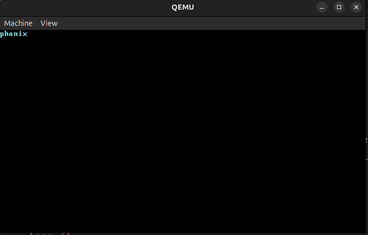

# Phanix: A 64-bit Memory-Safe Operating System

Phanix is a 64-bit operating system kernel developed from the ground up using the Rust programming language. The project aims to create a functional software environment from the bare-metal state of hardware, prioritizing memory safety, performance, and system stability.

## Technical Specifications
* **Target Architecture**: The kernel targets the x86_64 architecture, specifically operating in 64-bit Long Mode.
* **Toolchain**: Development utilizes the Rust nightly channel to access experimental features such as no_std and the bootimage crate for image creation.
* **Memory Management**: The system implements 4-level Paging with Recursive Page Table mapping for address space isolation.
* **Concurrency Model**: A cooperative multitasking model is employed via a specialized Async Task Executor.


## Current Branch Development: Bare-Metal Infrastructure and Verification
This branch focuses exclusively on the transition from a hosted freestanding binary to a verifiable bare-metal execution environment. The following technical implementations have been completed within this scope.

### Custom Target Configuration
A specialized target specification file has been developed to define the hardware constraints of the Phanix environment.
* **Target Triple**: The system targets x86_64-unknown-none to eliminate dependencies on existing operating system ABIs.
* **Linker Strategy**: The configuration utilizes the LLD linker with the rust-lld driver and the ld.lld flavor for cross-platform compatibility.
* **Panic Behavior**: The panic strategy is set to abort to comply with the lack of stack unwinding support in a bare-metal context.
* **Instruction Set Restrictions**: MMX and SSE features are disabled, and soft-float is enabled to prevent the use of large SIMD registers that complicate interrupt handling.
* **Red Zone Disable**: The x86_64 red zone optimization is disabled to ensure that hardware interrupts do not overwrite data on the kernel stack.

### Kernel Entry and Freestanding Execution
The kernel entry logic has been established to allow the CPU to begin execution without a standard library.
* **Entry Point**: A custom _start function has been implemented using the C calling convention and the no_mangle attribute to serve as the default linker entry point.
* **Panic Handling**: A freestanding panic handler has been implemented that enters an infinite loop, preventing undefined behavior upon system failure.

### Hardware Verification via VGA Buffer
To verify successful booting and memory mapping, a minimal hardware handshake was implemented.
* **Visual Output**: The system successfully renders the string "phanix" in light cyan text.




## Building and Execution
The kernel is configured to build for the custom x86_64-phanix target. The build-std feature is utilized in the local Cargo configuration to recompile the core and compiler_builtins crates for the specific hardware target.

```bash
# Compile the kernel and rebuild core library
cargo build

# Create bootable image and execute via QEMU
cargo run
