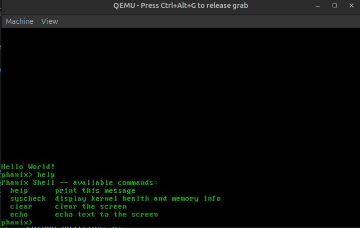
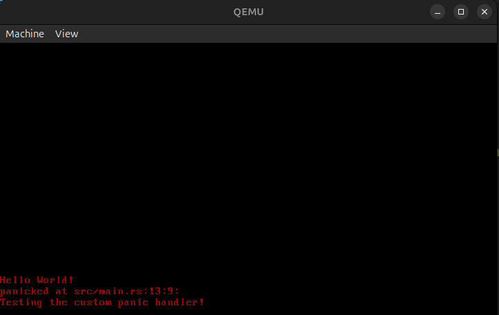
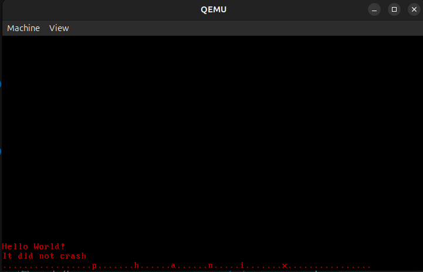

# Phanix: A 64-bit Memory-Safe Operating System

Phanix is a 64-bit operating system kernel developed from the ground up using the Rust programming language. The project creates a functional software environment from a bare-metal hardware state, prioritizing memory safety, performance, and system stability.

## Technical Specifications
* **Target Architecture**: x86_64 operates in 64-bit Long Mode.
* **Toolchain**: Rust nightly channel utilizing `no_std` compilation and the `bootimage` toolchain.
* **Memory Management**: 4-level Paging, custom global allocation engine (Bump, Linked List, and Fixed-Size Block), and physical frame management.
* **Concurrency Model**: Cooperative multitasking driven by an asynchronous Task Executor utilizing Waker primitives and a lock-free task queue.

---

## Architecture and Subsystem Modules

### Module 1: VGA Text Buffer Driver and Formatting Subsystem
This subsystem marks the transition from static hardware writes to a dynamic, thread-safe terminal interface.
* **Encapsulation**: Manages cursor positions, color attributes, and memory-mapped hardware pointers at address `0xb8000`.
* **Volatile Memory Safety**: Utilizes the `volatile` crate to wrap memory-mapped I/O operations, ensuring the compiler does not optimize away hardware writes.
* **Integration**: Implements `core::fmt::Write` wrapped in a global `WRITER` spinlock Mutex to expose standard `print!` and `println!` macro abstractions safely.

### Module 2: Automated Integration Testing Framework
This subsystem introduces a scalable, automated integration testing architecture to validate hardware states headlessly.
* **Port-Mapped I/O**: Interacts with QEMU via a dedicated debugging port at address `0xf4`.
* **ISA Debug Exit**: Transmits specific bit patterns to trigger an immediate, clean emulator shutdown upon test suite completion.
* **Exit Status Translation**: Captures custom hardware status codes (such as exit code 33 for success) and maps them back to standard host environment exit status codes.

### Module 3: Interrupt Handling Infrastructure
This subsystem transitions the kernel from a synchronous execution loop to a reactive, asynchronous runtime architecture.
* **Segment Allocation**: Configures a Global Descriptor Table (GDT) registering an independent 20 KiB emergency stack index within the Task State Segment (TSS) to catch double fault exceptions safely.
* **Interrupt Descriptor Table**: Sets up and loads the 256-slot IDT to catch CPU exceptions and hardware interrupts using the `x86-interrupt` calling convention.
* **PIC Remapping**: Remaps dual Intel 8259 Programmable Interrupt Controllers, moving Master lines to vector offset 32 (0x20) and Slave lines to 40 (0x28) to eliminate conflicts with internal CPU exception gates.

### Module 4: Memory Management Subsystem
This module replaces early physical tracking with a safe, production-grade virtual heap memory architecture.
* **4-Level Paging**: Traverses page table structures using physical memory offsets passed down by the bootloader to establish address space isolation.
* **Custom Heap Allocators**: Implements three unique memory allocator designs:
  * *Bump Allocator*: Linear pointer allocations providing O(1) velocity but requiring full resets to free memory.
  * *Linked List Allocator*: Tracks free regions via a chain of unallocated block headers, mitigating internal fragmentation at the cost of O(N) lookup times.
  * *Fixed-Size Block Allocator*: Directs small allocations (8 bytes to 2048 bytes) into dedicated power-of-two free list buckets for O(1) processing, utilizing the Linked List layout as a fallback mechanism for larger payloads.
* **Language Primitives**: Implements the `core::alloc::GlobalAlloc` trait wrapped inside a spinlock-backed `Locked<A>` template, enabling the native use of standard allocation primitives including `Box`, `Vec`, and `Rc`.

### Module 5: Asynchronous Multitasking (Async/Await) Runtime
This module builds a cooperative multitasking engine capable of running asynchronous background handlers.
* **Task Abstraction**: Encapsulates runtime futures into a structured `Task` type combined with an auto-incrementing atomic `TaskId`.
* **Waker Infrastructure**: Features a custom `TaskWaker` structure implementing the `core::task::Wake` interface. It maps hardware device events directly back to scheduling tasks.
* **Advanced Executor**: Utilizes a thread-safe, lock-free `ArrayQueue` to store execution rings, polling ready tasks via a `BTreeMap` lookup and processing sleep loops safely via `enable_and_hlt` instructions when the system state is idle.

---

## Hardware Verification and Execution Output

The kernel compilation and runtime subsystems have been fully verified inside the QEMU emulation layer.

### 1. Kernel Boot and Runtime Initialization
Upon launching the disk image, the kernel successfully maps physical frames, sets up page boundaries, initializes the heap allocation engine, and boots the asynchronous task executor loop.

<p align="center">
  
  <br>
  <b>Figure 1:</b> <i>Phanix Kernel booting up and successfully executing the async runtime environment.</i>
</p>

### 2. Interactive Asynchronous Shell Execution
The keyboard subsystem processes scancodes asynchronously by waking the shell execution task upon receiving hardware interrupts, translating input into readable terminal outputs.

<p align="center">
  
  <br>
  <b>Figure 2:</b> <i>Interactive shell interface processing asynchronous keyboard interrupt streams.</i>
</p>

### 3. VGA Text Formatting and Panic Interface Validation
The formatting engine routes diagnostic strings directly to the hardware display layout, providing immediate reporting structures upon critical supervisor execution errors.

<p align="center">
  
  <br>
  <b>Figure 3:</b> <i>Phanix Kernel rendering text metrics and catching diagnostic panic bounds at 0xb8000.</i>
</p>

### 4. Headless Core Automation and System Testing Metrics
The integration testing pipeline issues targeted execution routines over serial boundaries to prove isolation correctness across hardware components.

<p align="center">
  
  <br>
  <b>Figure 4:</b> <i>Verification output tracking automated integration test routines inside the headless runtime.</i>
</p>

---

## Technical Hurdles and Debugging

* **Circular Dependency Lockup (The Deadlock Race Condition)**: Occured when a timer interrupt preempted a thread that already held the global `WRITER` lock, causing the handler to spin infinitely. Resolved by introducing an interrupt-nesting rule using `without_interrupts` to disable interrupts during critical locking windows.
* **Single Keypress Lock (The Keyboard Buffer Stash)**: The keyboard controller would refuse to fire subsequent interrupts after the first keypress. Resolved by explicitly reading the raw scancode from port `0x60` to flush the hardware register.
* **Target Feature Atomic Misconfigurations**: Lock-free queues failed compilation on the bare-metal target due to missing atomic definitions. Resolved by modifying the custom target specification JSON to append `+atomic-64bit` and `+soft-float` flags.
* **Crate Registry Naming Mismatch**: Encountered a package resolution failure during cargo synchronization due to registry naming variations. Resolved by utilizing the exact hyphenated configuration format `conquer-once` inside the dependency definitions while maintaining the underscored import layout in the internal source modules.

---

## Building and Execution

### Prerequisites
Ensure your local development environment has the necessary target toolchain and bootimage utilities installed:
```bash
rustup component add rust-src --toolchain nightly-x86_64-unknown-linux-gnu
cargo install bootimage
